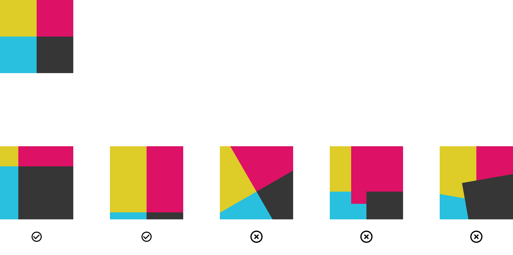

Heute beschäftigen wir uns mit dem Flächenaufteilung. Dazu gibt es eine Übungen. Theoretischen Hintergrund bekommen Sie im [dazu vorgesehenen Workshop](/mi-bachelor-screendesign/lehrveranstaltungen/030-workshop-flaeche-form/). Dort finden Sie auch den Link für die Uploadmöglichkeit.

---

## Flächenaufteilung

Erzeugen Sie eine weiße Arbeitsfläche von **210x210 Pixeln**. Darauf platzieren Sie vier Quadrate, ebenfalls 210x210 Pixel groß und platzieren diese so, dass sich die Spitzen in der Mitte der Arbeitsfläche treffen. Füllen Sie die Quadrate im Uhrzeigersinn beginnend mit links oben mit folgenden Farbwerten: `#DECC28`, `#DD1166`, `#28C0DE`, `#363636`<!--`#2C51BF`, `#03A65A`, `#F2AE2E`, `#D94625`-->. Entwicklen Sie nun durch Verschieben der Flächen 16 spannende und interessante Flächenaufteilungen.

<!--  -->

Legen Sie nun eine **952x1440 Pixel** große weiße Montagefläche mit vier Spalte (Gutter: 16px; Margin: 32px) und platzieren die 16 Flächenaufteilungen im Raster, so dass sich 4 Spalten und 4 Zeilen mit einem Abstand von jeweils 16 Pixeln ergeben. Bitte schreiben Sie Ihren Namen auf die Montage.

Exportieren Sie die Montage als PNG (2x) und laden Sie diese im Ilias hoch. Verwenden Sie beim Dateinamen bitte die folgende Nomenklatur:

`sd-aufgabe-flaechenaufteilung-NACHNAME.png`
